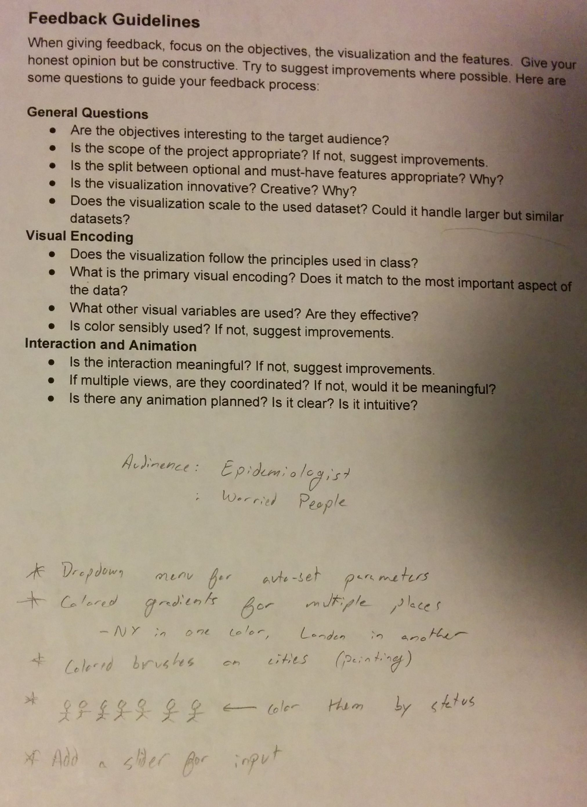
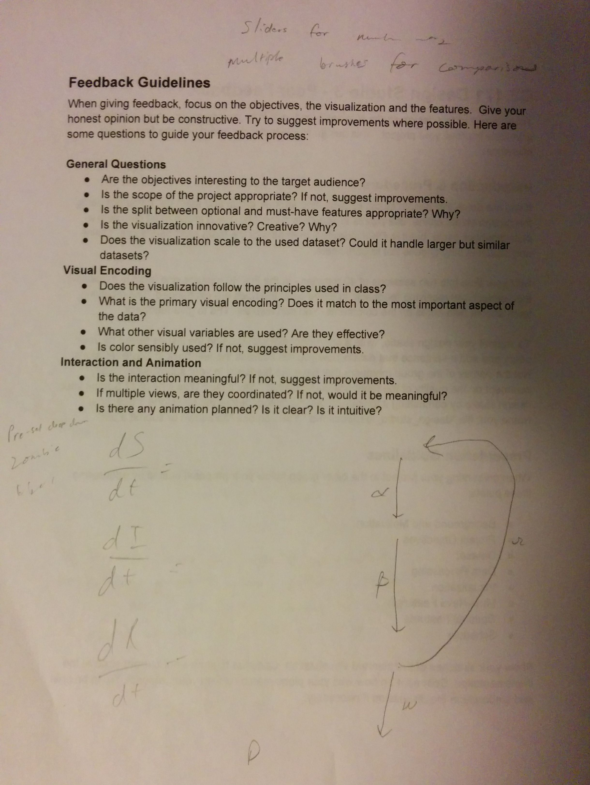

Feedback Group: Raahil Sha and Grigory and Himulya

Feedback: Below are the notes that Raahil and Grigory made as we discussed our idea

These are my own quick notes to explain the procedure to them.

Their primary concern was in the user interface. We showed them the visualization that inspired ours (the Zombies in the USA) and our sketches and they pointed out that sliders for value inputs would be nicer than typing in values. It was through prodding from them and our TF that we decided to add airport data for entry points of the diseases into different countries. They also helped us realize how unintuitive the model might be so we will have to add a good amount of detail to it. We will be addressing all of this feedback in our final design by offering good explanations to all the parameter settings.

Quality of feedback: It was great. They both were eager to hear about the design and had a lot of questions about how things would work along the way.